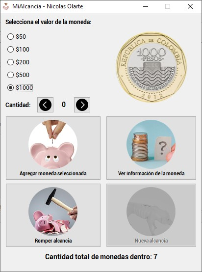

# MiAlcancia

Programa de alcancía hecho en Java usando HashMap de java.util y archivos binarios para el manejo de la persistencia.

***
Se requiere el código en Java para una alcancía teniendo en cuenta las siguientes instrucciones:
* La alcancía solo puede recibir monedas de 50, 100, 200, 500 y 1000 pesos colombianos.
* En cualquier momento yo puedo saber la cantidad de monedas dentro de la alcancía.
* En cualquier momento yo puedo saber la cantidad de monedas por denominación (50, 100, 200, 500 y 100) dentro de la alcancía. Es decir, yo puedo preguntar cuántas monedas de 100 tengo y la aplicación debe darme el resultado.
* En cualquier momento yo puedo saber la cantidad de dinero por denominación dentro de la alcancía. Es decir, yo puedo preguntar cuanto dinero tengo en monedas de 100 y la aplicación debe darme el resultado.
***
# Captura de pantalla

